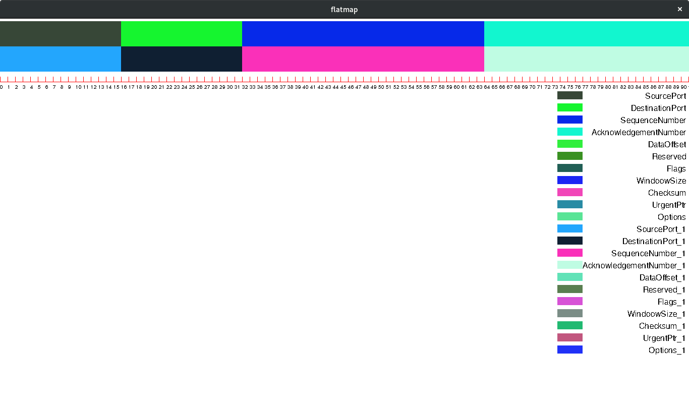

flatmap
--------------------------

Flatmap is a graphical tool for displaying things like memory mappings, protocol headers and data structures.

Flatmap is written in D and can be built with dub.

    dub build

It depends on SDL2 and SDL TTF.

An example file is included as 'tcp.dat'. It is structured with with fields:
Label | Offset | Block Count.

It produces the image: 

Flatmap can be ran as such:

    flatmap -f <filename> -d '<delimiting character>' -b <block size (default 1)> -w <display width (default 640)> -h <display height (default 480)>

All options apart from filename are optional.

### TODO list

- [ ] Move the SDL functions to their own classes/module so that we can mock them out
      for unittesting.
- [ ] Add a scale (which changes depending on block size) to bottom of graph
- [ ] Add ddoc documentation comments
- [ ] Implement proper unittesting with d-unit
- [x] Implement some nice way of closing the window
- [ ] Support piping in values on stdin
    - [ ] Support continuous updating from stdin values
- [ ] Support multiple graphs on the same screen
- [ ] Support saving image
- [x] Support specifying block sizes
- [ ] Support adding labels
- [x] Support a key
- [ ] Move the drawing to make sure it stays centered
- [ ] zoom support
